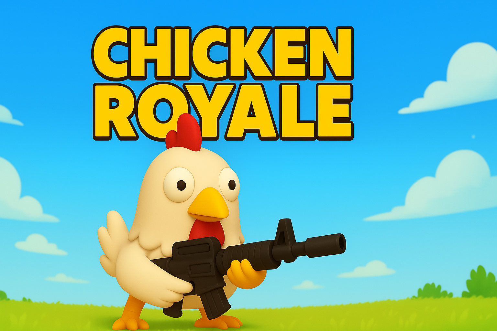

# 🐔 Chicken Royale

> Unity 기반의 3D TPS 슈팅 게임 (PC, Mac 지원)


---

## 🎬 Preview

<!-- -->
<p align="center">
  
  
  
</p>
<p></p>| 🔗 Chicken Royale  | <a href="https://youtu.be/cAq-W0X-D7M">[🔗 YouTube 플레이 소개영상 바로가기]</a> <p>

## 🧩 Game Features

- 🧠 AI 기반 몬스터 FSM 구현 (Trace / Attack / Die)
- 🎯 카메라 조준, 총기 발사, 수류탄 투척 시스템
- 🎮 대시 / 스태미너 시스템
- 🎁 적 처치 시 아이템 드랍 & 인벤토리 관리
- 🔊 BGM / SFX 동시 구현 (SoundMgr 기반)
- 🛠 버프, 힐, 골드 아이템 효과 반영 및 UI 연동
- ☁️ PlayFab 연동: 닉네임, 랭킹, 최고기록 DB 저장
- 📦 오브젝트 풀링 기반 몬스터 리스폰 시스템
- 🪂 타이틀 / 로딩 / 인게임 / 게임오버 화면 완비

---

## 🗂 프로젝트 구조 요약

| 항목 | 설명 |
|------|------|
| 🎯 **플레이어** | 움직임, 조준, 발사, 대시, 아이템 획득 |
| 👾 **적 AI** | FSM 기반 상태머신 (Idle/Trace/Attack/Die) |
| 💣 **수류탄 시스템** | 좌클릭 시 방향 기반 수류탄 투척 |
| 🎵 **사운드 시스템** | SoundMgr 기반 BGM/효과음 관리 |
| 📊 **UI 시스템** | 체력바, 수류탄 개수, 버프 상태, 인벤토리 |
| ☁️ **DB 연동** | PlayFab 로그인, 최고점수, 랭킹 등록 |
| 💾 **저장 시스템** | PlayerPrefs / 서버 기반 하이브리드 |
| 🧪 **테스트 및 개선** | 이슈 기반 QA 완료 및 최종 수정 반영 |

---

## ✅ 개발 로그 (주요 작업 내역)

- ✔️ 카메라 기준 캐릭터 회전 + 조준 확대
- ✔️ 총알 / 수류탄 충돌 판정 조정
- ✔️ 오브젝트 풀링 최적화
- ✔️ FSM 구조 개선 및 디버그
- ✔️ 타이틀/로딩/게임오버 화면 연출
- ✔️ PlayFab 연동으로 로그인 및 닉네임 저장
- ✔️ 랭킹 시스템 구축 및 동기화
- ✔️ 인벤토리 구현 및 판매 기능
- ✔️ 피드백 기반 버그 수정 & 디테일 개선

---

## 🚀 다운로드

- 🪟 [Chicken Royale (Windows)](https://drive.google.com/file/d/1As4TtGGFFEUW4Lsp4gfaKbw4A5it5-iG/view?usp=drive_link)
- 🍎 [Chicken Royale (Mac)](https://drive.google.com/file/d/18TPozFCqR7o2zRArwAGxigz77zB_Qn92/view?usp=drive_link)

---

## 🧠 Tech Stack

- **Unity 2021.x / 2022.x**
- **C# / Visual Studio**
- **PlayFab (랭킹/DB)**
- **Git LFS 사용**
- **Shader Graph, Timeline 일부 활용**

---

## 📌 이슈 및 개선사항 요약

| 이슈 | 해결 방법 |
|------|-----------|
| 조준 시 이동 어색함 | 카메라 위치 및 캐릭터 회전 로직 조정 |
| UI 비활성화 오류 | GameMgr에서 상태에 따라 동기화 |
| 버프 지속시간 적용 안됨 | 타이머 및 인덱스 리셋 로직 수정 |

---

## 🧪 피드백 반영

- ✅ 랭킹 시스템 → PlayFab 기반 완성
- ✅ 인벤토리 시스템 설계 및 구현
- ✅ 게임 전반 디버깅 및 QA 완료

---

## 🙋‍♂️ 개발자 정보

| 이름 | 링크 |
|------|------|
| 김종찬 (JongChan Kim) | [Github](https://github.com/Chan1605) / [Email](mailto:qkqhoe@naver.com) |

---

## 🔖 참고 문서

- [PlayFab 공식 문서](https://learn.microsoft.com/en-us/gaming/playfab/)
- [Unity 공식 매뉴얼](https://docs.unity3d.com/Manual/index.html)

## ⚠️ 주의사항: Terrain Texture(.tif) 누락 안내

본 프로젝트의 Terrain 텍스처 파일(`.tif`)은 Git LFS로 관리되고 있습니다.

### ⛔ 문제가 발생하는 경우:
- GitHub에서 프로젝트를 **zip 다운로드**할 경우 `.tif` 파일이 누락되어 **Terrain 지형 메시가 보이지 않습니다.**
- Unity에서 정상적으로 지형이 표시되지 않는다면, 아래의 방법을 확인해주세요.

### ✅ 해결 방법:
1. Git이 설치된 환경에서 아래 명령어로 클론해 주세요:
   ```bash
   git lfs install
   git clone https://github.com/Chan1605/Chan1605.git
